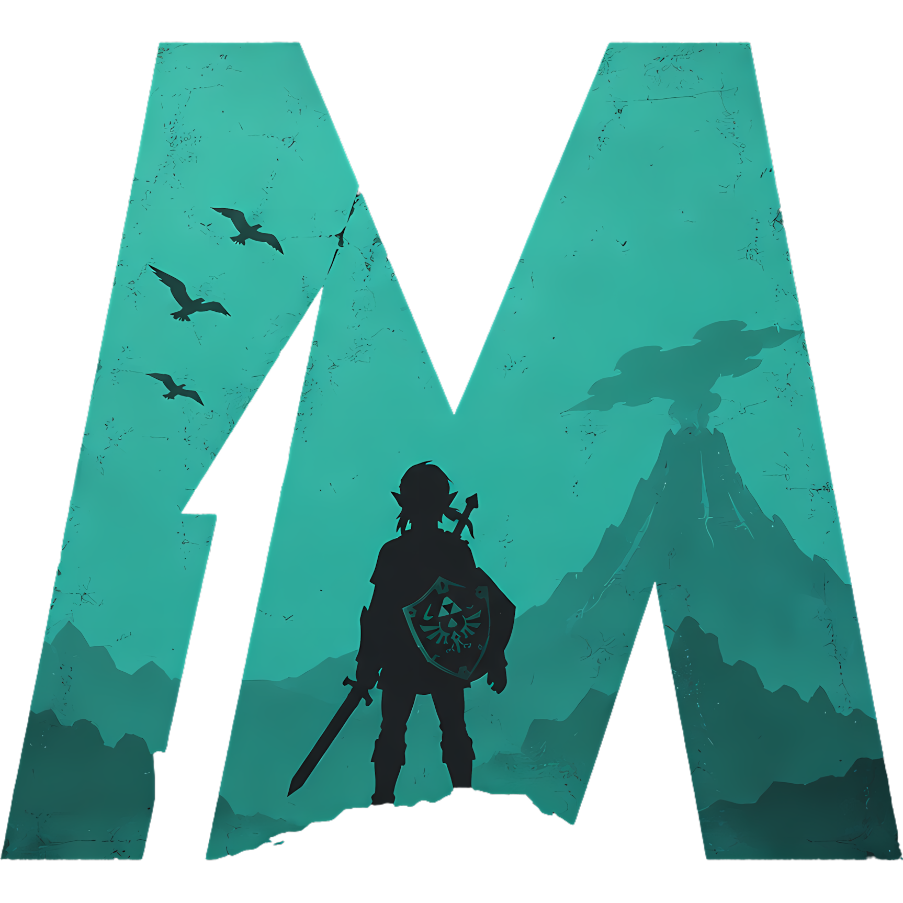

#  - BreathM

BreathM is a cross-platform multiplayer framework and launcher for **The Legend of Zelda: Breath of the Wild** on **Cemu**.

Inspired by FiveM and RedM, the long-term goal is to create a true multiplayer platform for BOTW rather than a simple launcher.

> Early alpha software. Expect bugs and breaking changes.

---

# Features

## Launcher

* Linux support
* Windows support
* Native Cemu support
* Flatpak Cemu support on Linux
* BOTW `.wua` support
* Manual path entry support
* Configuration persistence
* Multi-profile support

## Profiles

Each profile stores:

* Username
* Server address
* Cemu path
* BOTW path
* Region information
* Game version information
* Flatpak preference

## Multiplayer

* Dedicated Go server
* TCP networking
* MessagePack protocol
* Username system
* Connect / Disconnect
* Live player list
* Join notifications
* Leave notifications
* Event log

## Presence

* Launcher status
* In-game status
* Automatic game close detection
* Live status synchronization
* Discord Rich Presence support
* Connected player count in Discord

---

# Current Status

BreathM is currently around **Alpha 0.5 Preview**.

Completed:

* Launcher
* Profiles
* Multiplayer UI
* Dedicated server prototype
* MessagePack networking
* Player list
* Event log
* Presence system
* Discord Rich Presence
* Protocol version checking

No gameplay synchronization exists yet.

---

# Requirements

## Launcher

* Python 3.11+
* PySide6
* msgpack
* pypresence
* Cemu 2.x
* BOTW `.wua`

Install dependencies:

### Linux

```bash
python3 -m venv .venv
source .venv/bin/activate
pip install -r requirements.txt
```

### Windows

```powershell
py -m venv .venv
.venv\Scripts\activate
pip install -r requirements.txt
```

---

## Server

Requirements:

* Go 1.24+

Dependency:

```text
github.com/vmihailenco/msgpack/v5
```

---

# Running the Server

From the repository root:

```bash
cd server
go run main.go
```

Expected output:

```text
BreathM server listening on 127.0.0.1:30120
```

---

# Running the Launcher

Linux:

```bash
python3 main.py
```

Windows:

```powershell
python main.py
```

---

# Connecting

Example:

```text
Username: Maxim
Server: 127.0.0.1:30120
```

Click:

```text
Connect
```

The server will:

* Register the player
* Broadcast player lists
* Broadcast join events
* Broadcast leave events
* Synchronize player status

---

# Discord Rich Presence

BreathM supports Discord Rich Presence through `pypresence`.

Displayed information includes:

* Launcher status
* In-game status
* Connected player count

If Discord is unavailable, BreathM will continue running and retry later.

---

# Repository Structure

```text
BreathM/
├── main.py
├── requirements.txt
├── README.md
├── .gitignore
└── server/
    ├── go.mod
    ├── go.sum
    └── main.go
```

---

# Roadmap

## Alpha 0.1 — Launcher

Completed

* Launch BOTW from BreathM
* Linux support
* Windows support
* Config persistence
* `.wua` support

## Alpha 0.2 — Profiles

Completed

* Create profile
* Delete profile
* Switch profile
* Per-profile game paths
* Per-profile Cemu paths

## Alpha 0.3 — Multiplayer UI

Completed

* Username field
* Server address field
* Connect button
* Disconnect button
* Connection status

## Alpha 0.4 — Networking

Completed

* Dedicated server
* MessagePack protocol
* Join notifications
* Leave notifications
* Live player list

## Alpha 0.5 — Presence

Completed

* Launcher status
* In-game status
* Discord Rich Presence
* Connected player count
* Protocol version checks
* Region compatibility checks
* Multiplayer presence synchronization

## Alpha 0.6 — Networking & Compatibility Polish

Completed

* Live player list
* Join notifications
* Leave notifications
* Event log
* Protocol validation
* Region validation
* Discord Rich Presence synchronization
* Multi-instance Discord handling

## Alpha 0.7 — Cemu Integration Research

Planned

* Cemu process interaction
* Memory reading research
* Coordinate extraction research
* Cross-platform abstraction

## Alpha 1.0 — Real Multiplayer

Planned

* Shared player positions
* Ghost players
* Co-op synchronization
* Dedicated servers

---

# Compatibility Goals

Current expectation:

Players should use the same:

* BOTW region
* BOTW update version
* BOTW DLC version
* Mod set
* BreathM protocol version

Future versions may include:

* Version checking
* Compatibility warnings
* Mod synchronization
* Cross-version support research

---

# License

License information will be added in a future release.

